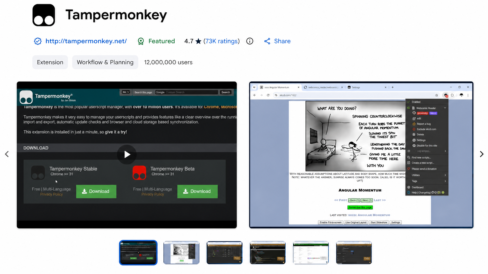

# ChatGPT Thread Archiver

ChatGPT Thread Archiver is a browser userscript that exports the **currently open ChatGPT or Claude.ai conversation** as a standalone HTML file you can keep and open offline.

It runs locally in your browser, uses your existing signed-in session, and does not upload your conversation to a third-party service.

> **Latest version**
>
> [Install the latest userscript](https://raw.githubusercontent.com/Satejp10/chatgpt-thread-archiver/main/dist/chatgpt-chats-exporter.user.js) · [Download the latest published release](https://github.com/Satejp10/chatgpt-thread-archiver/releases/latest/download/chatgpt-chats-exporter.user.js)
>
> The install link follows the reviewed `main` artifact. The release-download link becomes active after the first GitHub Release and always follows the latest published version.

## Install

### Quick install with Tampermonkey or another userscript manager



1. Open the [Tampermonkey listing in the Chrome Web Store](https://chromewebstore.google.com/detail/tampermonkey/dhdgffkkebhmkfjojejmpbldmpobfkfo), choose the browser’s install button, and accept the extension prompt.
2. Open [`dist/chatgpt-chats-exporter.user.js`](https://github.com/Satejp10/chatgpt-thread-archiver/blob/main/dist/chatgpt-chats-exporter.user.js) on GitHub, click **Raw**, and then click **Install** in your script manager.
3. Open or refresh a signed-in ChatGPT or Claude.ai conversation. The floating **Export HTML** button should appear. ChatGPT conversations opened inside Projects are supported through the `/g/<project>/c/<conversation>` route. A generic `/g/...` page or custom-GPT URL is not treated as a conversation.

If you already have an older version installed, remove the old userscript entry from Tampermonkey before installing this one.

## Use it

Open a conversation, click **Export HTML**, choose the available privacy, image, and branch options, and save the generated HTML file. The default export follows the currently selected branch. You can optionally include edited prompts and regenerated responses; when included, the offline file provides compact local arrow controls at each branch point, with counters such as `1/2` and `2/2`. Separate fork points remain separate, so an edited prompt and a regenerated response below it can each be navigated independently. In the exported file, use the **Dark mode** button in the upper-left corner to switch themes; your choice is remembered for future exports. The export also includes formatted messages, prompt navigation, copy buttons, and safe local statistics. ChatGPT images are included on a best-effort basis, and basic Claude.ai text export is supported.

When ChatGPT exposes an exact image-generation model in the image metadata, generated-image captions show it as **Image model: ...**. If the provider does not expose a reliable identifier, the export shows **Image model: unknown / not found** rather than guessing. This label follows the optional message-model display preference.

## Privacy

The script does not ask for your password, persist conversation content, or call third-party services. Requests go only to the provider's own web application through your existing browser session.

## Current limitations

The script exports only the conversation currently open in the browser; bulk or all-chat export is not supported. Current-branch export remains the default, while the optional all-branch export is limited to the forks exposed by the provider response. The message-level controls are an experimental approximation of the native ChatGPT experience; provider web-app interfaces and internal tree formats may change, and unsupported files or rich-content blocks may appear as omission markers instead of being fully rendered.

## Development

The project requires **Node.js 20 or newer** and has no third-party dependencies. From the project directory:

```bash
npm run build
npm run check
node --check dist/chatgpt-chats-exporter.user.js
```

For maintainer details, see the [developer handoff](docs/developer-handoff.md), [build history](docs/build-history.md), and [user testing checklist](docs/user-test-checklist.md).
